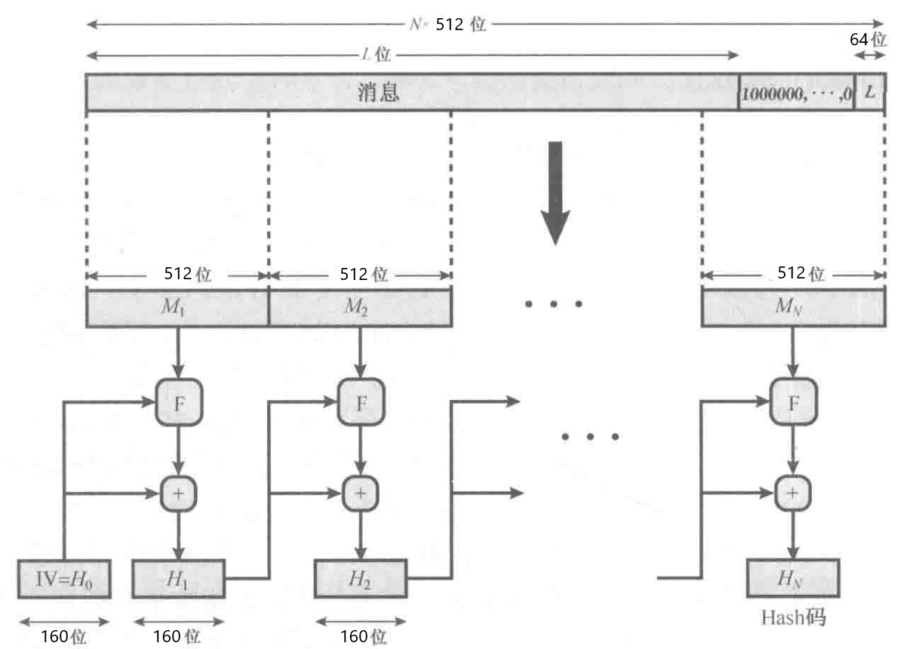
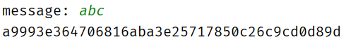
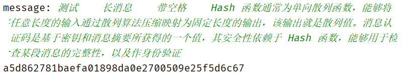
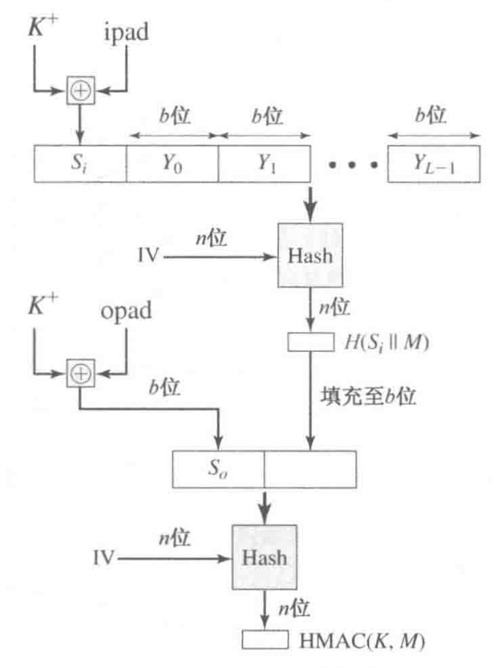
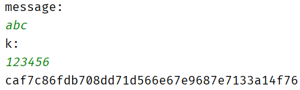
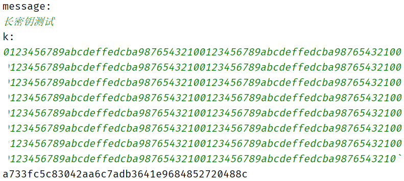
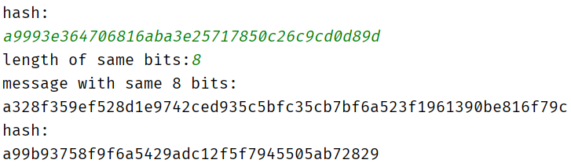
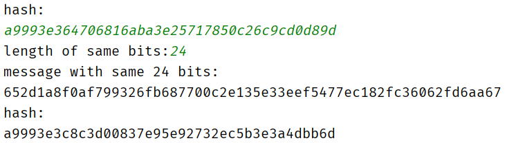
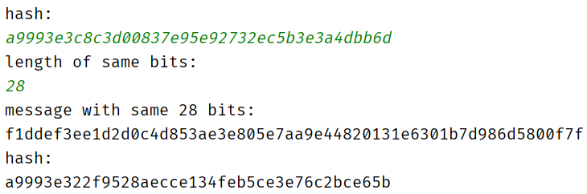

包括SHA-1，HMAC-SHA-1，和伪第一类生日攻击。

## 实验报告

### 【实验目的】

1.   理解密码学 Hash 函数的安全性质、攻击方法、设计思想，掌握常用的密码学 Hash函数的实现流程。
2.   理解消息认证码的设计思想，掌握基于 Hash 函数的消息认证码 HMAC 的实现方法。。

### 【原理简介】

Hash 函数通常为单向散列函数，能够将任意长度的输入通过散列算法压缩映射为固定长度的输出，该输出就是散列值。消息认证码是基于密钥和消息摘要所获得的一个值，其安全性依赖于 Hash 函数，能够用于检查某段消息的完整性，以及作身份验证。

### 【实验环境】

Windows 10，IntelliJ IDEA Community Edition 2020.1.1，JDK 14.0.1。

###  【实验内容】

#### 一、SHA-1

##### 1. 算法原理

SHA-1（英语：Secure Hash Algorithm 1，中文名：安全散列算法1）是一种密码散列函数，美国国家安全局设计，并由美国国家标准技术研究所（NIST）发布为联邦数据处理标准（FIPS）。SHA-1可以生成一个被称为消息摘要的160位（20字节）散列值，散列值通常的呈现形式为40个十六进制数。

##### 2. 算法流程

流程如下：



伪代码如下：

```c
hash(m):
m = padding(m);
group = m.length/512;
h = {0x67452301, 0xEFCDAB89, 0x98BADCFE, 0x10325476, 0xC3D2E1F0};
for i = 0 to group-1
    w = expand(m[i]);
	h = f(h,w);
return h;

f(h,w):
	a,b,c,d,e = h[0],h[1],h[2],h[3],h[4];
for i = 0 to 79
	h[0],h[1],h[2],h[3],h[4] ← (h[0]<<<5)+ft(h[1],h[2],h[3])+h[4]+w[i]+kt,h[0],h[1]<<<30,h[3],h[4];
return h;
```

其中`ft(b,c,d)`根据不同的轮数计算方式也不同，kt也是和轮数相关的常数。

##### 3. 测试样例及运行结果

- 消息：“`abc`”，hash值：`0xa9993e364706816aba3e25717850c26c9cd0d89d`：



- 消息：“`测试    带空格`”，hash值：`0x8db23dc3ff1d9d51c62816ae413e2d5e36d545eb`：


- 消息：“`测试    长消息    带空格    Hash 函数通常为单向散列函数，能够将任意长度的输入通过散列算法压缩映射为固定长度的输出，该输出就是散列值。消息认证码是基于密钥和消息摘要所获得的一个值，其安全性依赖于 Hash 函数，能够用于检查某段消息的完整性，以及作身份验证`”，hash值：`0x8db23dc3ff1d9d51c62816ae413e2d5e36d545eb`：



##### 4. 总结

在Java中，整数都是有符号的，最高位为符号位，在进行位运算时应该考虑这一点。例如，使用运算符`>>`时不会移动符号位，应该使用`>>>`同时移动符号位。

Hash码的每一位都是全部输入位的函数。基本函数F多次复杂重复运算使得结果充分混淆，从而使得随机选择两个消息，甚至于这两个消息有相似特征，都不太可能产生相同的Hash码。但是，2017年2月23日，CWI Amsterdam与Google宣布了一个成功的SHA-1碰撞攻击，发布了两份内容不同但SHA-1散列值相同的PDF文件作为概念证明。

#### 二、HMAC-SHA-1

##### 1. 算法原理

HMAC是密钥相关的哈希运算消息认证码（Hash-based Message Authentication Code）的缩写，由H.Krawezyk，M.Bellare，R.Canetti于1996年提出的一种基于Hash函数和密钥进行消息认证的方法，并于1997年作为RFC2104被公布，并在IPSec和其他网络协议（如SSL）中得以广泛应用，现在已经成为事实上的Internet安全标准。它可以与任何迭代散列函数捆绑使用。

由于SHA-1不依赖于秘密钥，所以不能直接用于MAC。HMAC-SHA-1是基于SHA-1算法的MAC。不同HMAC算法的区别就是Hash函数不同。HMAC可以描述为$HMAC(K,M)=H[(K^+⊕opad)||H[(K^+⊕ipad)||M]]$。

##### 2. 算法流程

加密流程如下：



伪代码如下：

```c
encrypt(m,k):
kPlus = padding(k);
si = kPlus⊕ipad;
h = hash(si||m);
s0 = kPlus⊕opad;
return hash(s0||h);
```

##### 3.测试样例及运行结果

- 消息：“`abc`”，密钥：`0x123456`，MAC：`0xcaf7c86fdb708dd71d566e67e9687e7133a14f76`：



- 消息：“`长密钥测试`”，密钥：`0x0123456789abcdeffedcba98765432100123456789abcdeffedcba98765432100123456789abcdeffedcba98765432100123456789abcdeffedcba98765432100123456789abcdeffedcba98765432100123456789abcdeffedcba98765432100123456789abcdeffedcba98765432100123456789abcdeffedcba98765432100123456789abcdeffedcba98765432100123456789abcdeffedcba98765432100123456789abcdeffedcba98765432100123456789abcdeffedcba98765432100123456789abcdeffedcba98765432100123456789abcdeffedcba98765432100123456789abcdeffedcba98765432100123456789abcdeffedcba9876543210`，MAC：`0xa733fc5c83042aa6c7adb3641e9684852720488c`：



#### 三、 对SHA-1的第一类生日攻击

##### 1. 算法原理

对于给定的输出 H(x)，随机生成输入串，以得到某个输出 H(y)，使得它的前n 比特与 H(x)相同。

平均经过$\sqrt{\fracπ2N}$次计算就有50%的概率发生碰撞，其中N表示哈希的取值空间。

##### 2. 算法流程

算法比较简单，只需要随机生成消息，计算hash值，和给定的hash值对比就可以了。

伪代码如下：

```c
attack(h,n):
while true
    b = random(240);
	h1 = hash(b);
	if sameBits(h,h1)>=n
        return b;
```

其中b为随机产生的240位消息，由于SHA-1的输出为160位，所以选择超过160位的消息发生碰撞的可能性更大。`sameBits(h,h1)`为计算h和h1从最高位开始连续相同的位数。

##### 3.测试样例及运行结果

给定hash值`0xa9993e364706816aba3e25717850c26c9cd0d89d`（“abc”的hash值）。

消息表示为16进制。

- 前8位hash值相同的消息`0xa328f359ef528d1e9742ced935c5bfc35cb7bf6a523f1961390be816f79c`，hash值`0xa99b93758f9f6a5429adc12f5f7945505ab72829`：



- 前24位hash值相同的消息`0x652d1a8f0af799326fb687700c2e135e33eef5477ec182fc36062fd6aa67`，hash值`0xa9993e3c8c3d00837e95e92732ec5b3e3a4dbb6d`：



- 前30位hash值相同的消息`0xf1ddef3ee1d2d0c4d853ae3e805e7aa9e44820131e6301b7d986d5800f7f`，hash值`0xa9993e322f9528aecce134feb5ce3e76c2bce65b`：



##### 4. 总结

由于直接生成具有相同hash值的消息在计算上不可行，所以只能通过产生随机数的方法来寻找相同hash值的消息。而不同的hash值对应的消息数量也不同，可能有些hash值只对应极少的几个消息，而且计算次数随着相同位数增长极快，这也给攻击带来了困难。
